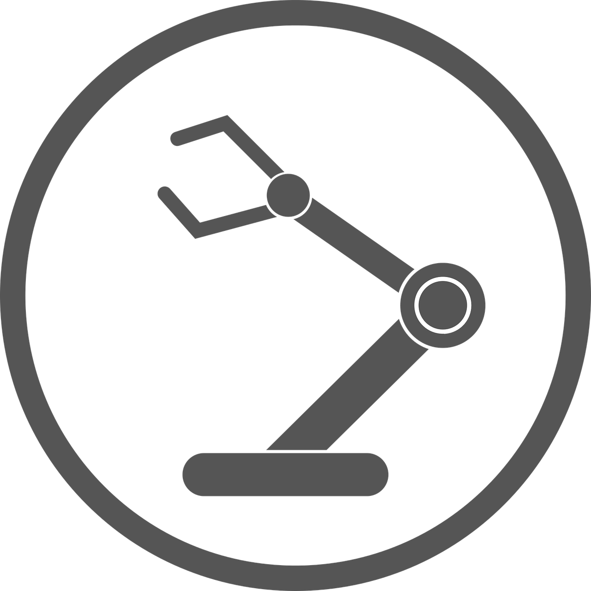
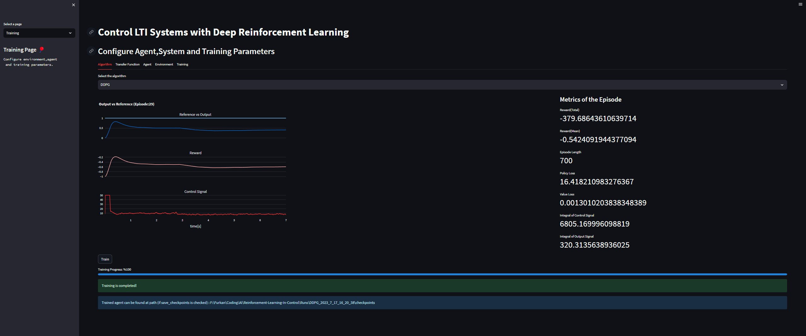
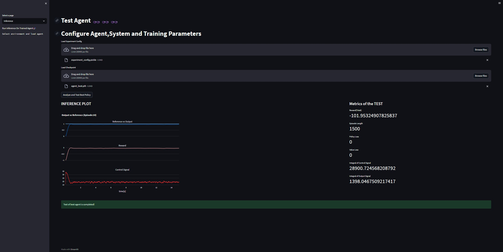
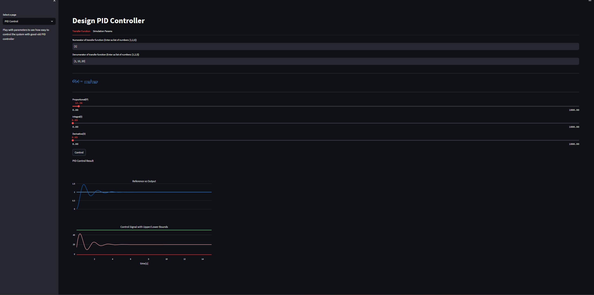

<h1 align="center"> RlControl </h1>
<h3 align="center">  Designing Controllers via Deep Reinforcement Learning </h3>

 

  

<!-- ABOUT THE PROJECT -->
<h2 id="about-the-project"> :pencil: About The Project</h2>

    The project aims to control linear/nonlinear dynamical systems
    in model-free and model-based setting
    with SOTA deep reinforcement learning algorithms

<h2 id="liveApp" href=> <a href="https://rlcontrol.streamlit.app"> Try App Live with Streamlit! </a> </h2>

  

  

  

<!-- INSTALL HOW TO -->
<h2 id="install"> Installation Steps</h2>

  Follow steps below,

    1. Create Conda environment:
        - 'conda env create --name rlcontrol --file=environment.yml'

    2. Install OpenAI Gym Environment
        - Install gym_control environment: `pip install -e .`

    - Export conda env yaml: `conda env export > environment.yml --no-builds`
    - Export conda env yaml as requirements.txt: `conda list -e > requirements.txt`

  
<h2 id="install">Run App in Local </h2>
  
    1. Activate rlcontrol environment
      `conda activate rlcontrol`
    2. Run streamlit app and watch app at `http://localhost:8502`
      `streamlit run app.py` 
  
  Build for docker based deployment
  - `docker build -t streamlit .`

  

<!-- PREREQUISITES -->
<h2 id="prerequisites"> :fork_and_knife: Prerequisites</h2>

<!--This project is written in Python programming language.  -->
The following open source packages are used in this project:
* streamlit
* torch
* ray
* rllib
* control
* gymnasium
* tensorboardx
* tqdm
* numpy
* matplotlib
* plotly
* pandas
* pickle5
* 

<h2 id="future"> Future Work and TODOs</h2>

 
  - Add class diagram of project,   
  - Train environemnt with rllib
  - Track experiments from db (postgresql)
  - Fix seeds
